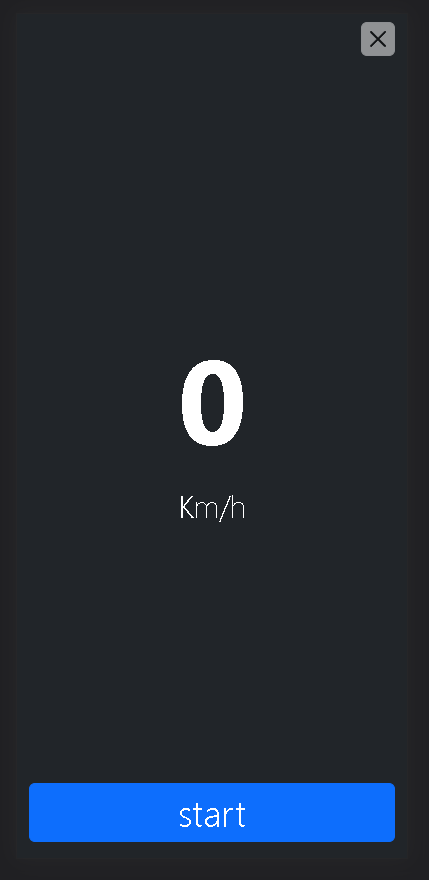

<h1>Ride</h1>

  <h3>app-web criado para ser utilizado no celular!!</h3>
 

após inciar e parar uma corrida ele exibe as seguintes informações:

<ul>
  <li>Localização da corrida: Cidade-País </li>
  <li>Velocidade Maxima alcançada</li>
  <li>Duração da corrida</li>
  <li>horário e data da corrida</li>
</ul>

<h2>Telas:</h2>

  <h3>Tela principal:</h3>

  
  
  

    Esta tela exibe todas as corridas realizadas.
  

  <h3>Medidor:</h3>
  
  
  
  
ao clicar em "start" é iniciado uma nova corrida:

